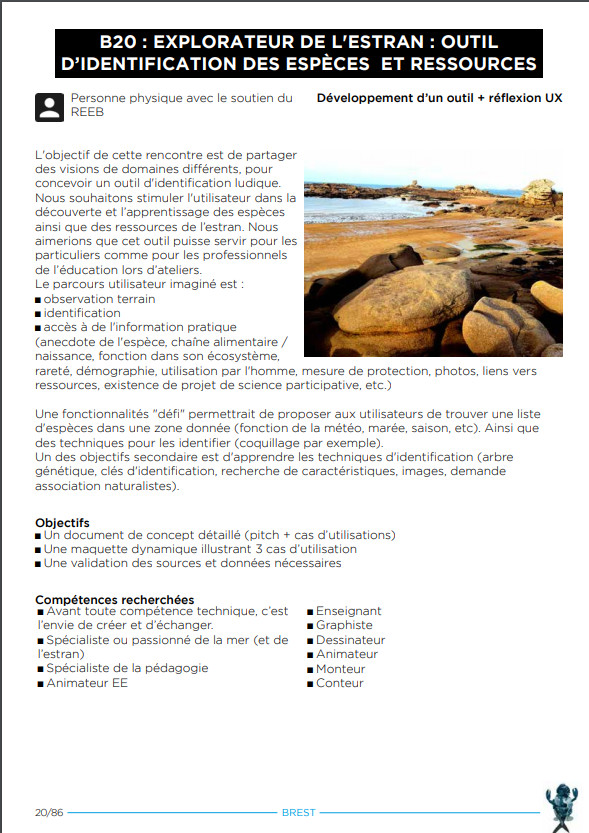

# HackathonOcean2019
Ce prototype à été créé en moins de 48h dans le cadre de l'océan Hackathon 2019 à Brest.



Notre équipe #B20 avons imaginé un concept : Ouestran, un dispositif intéractif d'identification des espèces de l'estran.

L'équipe était composée de 
* Alain Lamy
* Mathilde Artigan
* Tanguy Genthon
* Léna Roisil
* Pierre Honoré
* Jimmy Reynes
* Hineiti Hatitio
* Loïc Druesne (porteur projet)

# Lancement du prototype
* installer node.js (https://nodejs.org/en/)
* installer  (https://git-scm.com/)
* Puis suivre les instructions suivantes dans un terminal
```
# récupérer le dépot
$ git clone https://github.com/kaonL0/HackathonOcean2019.git
# Se déplacer dans le répertoire du projet
$ cd HackathonOcean2019
# installer les modules
$ npm install
# lancer le server
$ http-server -o --cors  

# ensuite aller sur la  http://127.0.0.1:8080/index.html
```

# Données utilisées 
https://data.shom.fr/donnees/legend/NDF_PYR-PNG_WLD_3857_WMTS#001=eyJjIjpbLTUxMTI4Ny4yODIxOTk1NDM3LDYxNzU1MDAuMzg5MjE1OTU5XSwieiI6MTEsInIiOjAsImwiOlt7InR5cGUiOiJJTlRFUk5BTF9MQVlFUiIsImlkZW50aWZpZXIiOiJOREZfUFlSLVBOR19XTERfMzg1N19XTVRTIiwib3BhY2l0eSI6MSwidmlzaWJpbGl0eSI6dHJ1ZX0seyJ0eXBlIjoiSU5URVJOQUxfTEFZRVIiLCJpZGVudGlmaWVyIjoiRkRDX0dFQkNPX1BZUi1QTkdfMzg1N19XTVRTIiwib3BhY2l0eSI6MSwidmlzaWJpbGl0eSI6dHJ1ZX1dfQ==

https://services.data.shom.fr/geonetwork/srv/fre/catalog.search#/metadata/HOM_GEOL_NATURES_FOND_50.xml

ftp://eftp.ifremer.fr/hackathon/SHOM_TousSites/Shom_17_PredictionsMaree2019/Zone_Brest-Iroise/